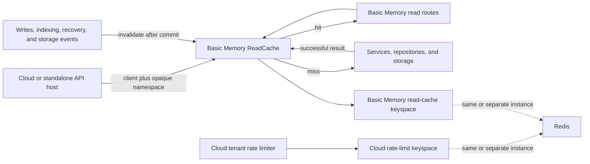

# Redis Read Cache Plan

## Status

Accepted implementation plan. Basic Memory owns semantic read caching; Basic Memory Cloud owns
tenant and principal rate limiting. The datasets are logically isolated even when they share a
Redis instance.

## Goals

- Reduce latency and database work for repeated entity and note reads.
- Keep Redis optional so the default local-first installation has no external service
  requirement.
- Make cache semantics, typed serialization, TTLs, and invalidation part of Basic Memory.
- Let a host such as Basic Memory Cloud inject an existing Redis client and opaque namespace.
- Preserve independent clients, key prefixes, metrics, and failure behavior for read caching and
  rate limiting.

## Ownership Boundary

Basic Memory owns:

- cacheable read operations;
- canonical request keys;
- typed serialization;
- TTL and payload-size policy;
- project-scoped invalidation;
- the no-op and Redis read-cache implementations.

Cloud owns:

- tenant and principal identity;
- rate-limit policy and enforcement;
- the Redis deployment topology;
- the opaque cache namespace supplied to Basic Memory;
- capacity, eviction, and availability decisions when Redis is shared.

Physical topology is deliberately outside the Basic Memory cache contract. Cloud may point the
read cache and limiter at separate Redis instances or at separately configured clients on one
instance.

### Tenant isolation on shared Redis

Cloud does not create a Redis instance or connection pool per tenant. It reuses one long-lived,
Basic Memory-specific Redis client and constructs a lightweight `RedisReadCache` adapter from
trusted request or worker context:

- `namespace`: the stable tenant/workspace UUID;
- `project_id`: the Basic Memory project external UUID;
- `prefix`: the Basic Memory read-cache keyspace, separate from rate limiting.

The adapter hashes `(namespace, project_id)` into the Redis Cluster scope. Two tenants with the
same project identifier therefore cannot share a generation or data key. Tenant isolation must
not rely on project UUID uniqueness alone: every Cloud read and invalidation supplies the
authenticated tenant/workspace UUID, even when project UUIDs are globally unique in practice.

The namespace is host-owned isolation context, not an API input. Never derive it from a display
name or slug, accept it from a caller, or include API keys and other secrets in it. API requests
and background workers must use one canonical tenant-to-namespace function so an index worker
invalidates the exact scope populated by the request path.

### Cloud host requirements

Basic Memory Cloud must satisfy all of these requirements before enabling cached reads for a
tenant:

1. Derive one stable namespace from authenticated Cloud context. The preferred value is the
   tenant UUID or workspace UUID already owned by Cloud. Project UUID alone is not a tenant
   boundary, even if current database constraints make it globally unique.
1. Complete authorization and tenant database/schema selection before cache lookup. The
   namespace prevents key collisions; it does not replace Cloud's access-control boundary.
1. Override `get_read_cache` at the Cloud composition root. Construct
   `RedisReadCache(client=shared_basic_memory_client, namespace=trusted_namespace)` as a
   lightweight request-scoped adapter; reuse the long-lived client and connection pool.
1. Pass the trusted tenant/workspace identity through internal queue payloads, or include enough
   trusted identifiers for workers to derive the exact same namespace. Never copy a namespace
   from a public request field.
1. Inject the namespace-bound cache into every mutation-producing runtime: accepted note
   materialization, object-storage events, direct and project indexing, directory moves/deletes,
   watcher-detected paired moves, relation-resolution workers, and startup recovery or
   reconciliation. Request-path invalidation alone is insufficient because a worker can update a
   cached entity after the request returns.
1. Treat each asynchronous state transition as a separate freshness boundary. Invalidate after
   the accepted-note transaction commits, again after terminal materialization/status publication
   and indexing, and again after relation resolution completes. This prevents a read filled
   between phases from surviving the later worker commit.
1. Invalidate watcher-detected moves at their own completion boundary. Paired delete/create
   events are consumed by move processing and therefore bypass the ordinary watcher callbacks.
1. If startup recovery or reconciliation changes materialization, vacate, index, or relation
   state, invalidate through the same namespace-bound cache before releasing the serving barrier
   or resuming tenant traffic.
1. Keep `bm:read:v1` separate from rate-limit and Cloud control-plane prefixes, metrics,
   timeouts, and failure policies. The clients may target one Redis deployment, but a read-cache
   timeout must bypass while a rate-limit decision keeps its Cloud-owned security behavior.
1. Enable reads only after request and worker invalidation use the same namespace in the target
   environment. Roll out by tenant cohort, watch hit/bypass/invalidation outcomes and database
   queries, then remove overlapping Cloud gateway response caches only after parity.
1. Coordinate rolling deployments around the `bm:read:v1` payload/key contract. Bump the prefix
   for incompatible serialized response changes so mixed application versions never interpret
   one another's payloads with different schemas.

If Cloud ever changes the namespace source, treat that as a cache-key migration. A new namespace
is safe because it cannot read the old tenant scope, but old keys remain until their TTLs expire
and every worker must switch atomically enough to avoid missing invalidations.

## Architecture



## Core Contract

Introduce `src/basic_memory/read_cache/` with:

- a narrow `ReadCache` protocol;
- immutable request/key values;
- a `NullReadCache` default;
- canonical key construction;
- typed Pydantic read-through helpers;
- an optional `RedisReadCache` adapter.

The cache is namespace-bound at construction. Its public operations are:

- `lookup(key)`, which returns the generation observed with a hit or miss;
- `store(key, lookup, payload, ttl)`, which reports stored, superseded, or disabled;
- `invalidate_project(project_id)`.

Cloud can create a lightweight namespace-bound adapter around a long-lived, Basic
Memory-specific async Redis client. Basic Memory does not receive tenant, subscription, or
rate-limit concepts.

## Keys And Invalidation

Use versioned, cluster-compatible keys:

```text
bm:read:v1:{scope_digest}:generation
bm:read:v1:{scope_digest}:<operation>:<request_digest>
```

`scope_digest` hashes the host-supplied tenant/workspace namespace and project external ID. The
Redis Cluster hash tag keeps that tenant-project scope's generation and data keys in one slot.

Each value records the random generation token under which it was created:

1. Read the generation and data key together.
1. Accept the cached value only when its embedded generation matches.
1. After a successful mutation commit, replace the generation with a new random token.
1. Let unreachable entries expire; never scan or bulk-delete keys.

Random tokens prevent an evicted generation key from returning to an old integer generation and
reviving stale data. A read that fills after concurrent invalidation also remains safe because its
old token no longer matches.

## Initial Cache Surface

Phase one:

| Operation              | Initial TTL | Constraints                             |
| ---------------------- | ----------: | --------------------------------------- |
| Entity by external ID  |  60 seconds | Cache validated `EntityResponseV2` JSON |
| Identifier resolution  |  60 seconds | Include body and workspace context      |
| Markdown note resource |  60 seconds | Cache only below an explicit size limit |

Phase two, after measuring phase one:

| Operation                   |   Initial TTL | Constraints                                    |
| --------------------------- | ------------: | ---------------------------------------------- |
| Search                      |    30 seconds | Canonicalize the complete query and pagination |
| Directory reads             | 30-60 seconds | Key every filtering and pagination input       |
| Context and recent activity | 15-30 seconds | Normalize or bound time-relative inputs        |

Do not initially cache failures, missing entities, graph/orphan responses, large or arbitrary
binary resources, schema inference, writes, or Cloud control-plane data.

Caching is semantic rather than HTTP-method based. The POST identifier-resolution and search
operations can be cached without changing their public API. Identifier resolution depends on the
request-local workspace permalink context, so its request digest includes the workspace slug and
workspace type in addition to the validated request body.

## Placement

Cache typed boundary values rather than SQLAlchemy models. Use an explicit read-through helper in
the API routes so hit, miss, serialization, and fallback behavior remain visible.

Primary integration points:

- `src/basic_memory/api/container.py`
- `src/basic_memory/api/app.py`
- `src/basic_memory/deps/read_cache.py`
- `src/basic_memory/api/v2/routers/knowledge_router.py`
- `src/basic_memory/api/v2/routers/resource_router.py`
- later, `src/basic_memory/api/v2/routers/search_router.py`

Invalidation belongs at portable mutation and indexing completion boundaries, not only in
FastAPI routes. It must cover accepted note writes, terminal deferred materialization and status
publication, direct file indexing, filesystem watcher updates, project indexing, directory
mutations, watcher-detected paired moves, startup recovery or reconciliation, Cloud storage
events, and relation-resolution changes that affect cached responses. Each later phase
invalidates again so a value filled after an earlier generation bump cannot outlive the state
that phase publishes. Recovery invalidation runs before the serving barrier is released.

## Dependency And Lifecycle

Use the official asynchronous `redis-py` client behind the Basic Memory protocol. Add it only as
an optional package extra. A host may instead supply a compatible, already-owned client.

The Core `ApiContainer` carries `NullReadCache` by default. A managed host activates caching by
injecting or dependency-overriding a namespace-bound implementation and owns that client's
lifecycle; Cloud therefore reuses its long-lived Basic Memory cache client. Local CLI, MCP
in-process ASGI routing, and the standalone API remain on `NullReadCache` in the first rollout.
A later standalone Redis setting can create and close a client in the FastAPI lifespan without
changing the cache contract.

The FastAPI Redis SDK is not the foundational dependency for this work. The cache contract must
also participate in portable indexing and hosted storage-event invalidation, and Basic Memory's
local ASGI transport does not run FastAPI lifespan.

## Failure Behavior

- Connection and timeout failures are represented explicitly as cache-unavailable outcomes.
- Reads bypass Redis and use the authoritative path when the cache is unavailable.
- Cache-store failures do not fail an otherwise successful read.
- Cache-invalidation failures do not fail committed writes, but they emit prominent telemetry.
- Short initial TTLs bound stale-data exposure after an invalidation failure and Redis recovery.
- Serialization and programming errors fail fast rather than masquerading as cache misses.

Rate-limit failure behavior remains entirely Cloud-owned.

## Observability

Record:

- hit, miss, bypass, store, invalidation, unavailable, and oversize outcomes;
- operation name without tenant or project metric labels;
- Redis operation latency;
- cached payload size;
- authoritative read latency on misses;
- hashed scope and request identifiers on diagnostic spans only.

Do not add public cache headers in the first version.

## Integration Tests

Redis behavior must be tested against a real Redis server, not a mocked or in-memory substitute.
Integration tests will start Redis through testcontainers or use an explicitly configured CI
Redis URL.

Run the focused suite with:

```bash
LOGFIRE_IGNORE_NO_CONFIG=1 uv run pytest -p pytest_mock --no-cov -q test-int/read_cache
```

`BASIC_MEMORY_TEST_REDIS_URL` selects an externally managed test server. Otherwise the fixture
starts `redis:8.8-alpine`; `BASIC_MEMORY_TEST_REDIS_IMAGE` can override that image without
changing the test contract.

The real-Redis suite must prove:

- namespace, project, operation, and request isolation;
- deterministic canonical keys;
- cache hit and TTL expiry behavior;
- project invalidation;
- a fill that completes after invalidation is never served;
- loss of the generation key cannot revive an older value;
- Redis restart or unavailability produces explicit bypass behavior;
- no invalidation operation touches keys outside the Basic Memory prefix;
- payload size limits;
- repeated API entity reads use the real cached representation;
- successful writes invalidate while rejected or rolled-back writes do not;
- watcher-detected paired moves invalidate even though their events bypass ordinary callbacks;
- startup recovery that changes materialization state invalidates before serving resumes.

Run route behavior against both SQLite and Postgres where persistence behavior differs. Redis
semantics themselves are asserted only against the real Redis integration fixture.

## Delivery Sequence

### 1. Cache infrastructure

- Add the protocol, key values, no-op backend, Redis adapter, typed helper, optional dependency,
  telemetry, and real Redis integration tests.
- Do not cache production routes yet.

### 2. Hot entity reads

- Cache entity, resolution, and bounded markdown-resource reads behind default-off configuration.
- Wire project invalidation through accepted writes and indexing paths.
- Add full-stack API and repeated `read_note` integration coverage.

### 3. Cloud rollout

- Inject a Basic Memory-specific Redis client and tenant namespace.
- Derive that namespace from trusted request and worker context with one canonical function.
- Invalidate after accepted-note commit, terminal materialization/indexing, storage events, and
  relation-resolution workers using the same tenant namespace as the request path.
- Invalidate watcher-detected paired moves at move completion, and invalidate any recovery or
  reconciliation state change before releasing the serving barrier or resuming tenant traffic.
- Enable reads for a tenant only after every request, worker, move, and recovery boundary has
  namespace and invalidation parity.
- Start with shadow telemetry or a limited tenant cohort.
- Compare hit rate, Redis latency, database query volume, and end-to-end tool latency.

### 4. Expand from evidence

- Add search, directory, and graph-context reads when measured reuse supports them.
- Refine project-wide invalidation only if unrelated writes materially reduce the entity hit
  rate.

### 5. Remove overlap

- Remove matching Cloud gateway response-cache families once Basic Memory caching reaches
  behavioral and observability parity.

## Verification Gates

- Focused unit and real Redis integration tests.
- Entity/read API integration tests on SQLite and Postgres.
- `just fast-check`.
- `just doctor`.
- The appropriate broader SQLite and Postgres suites before opening a pull request.
- A before/after benchmark showing cache-hit latency and reduced authoritative reads.
