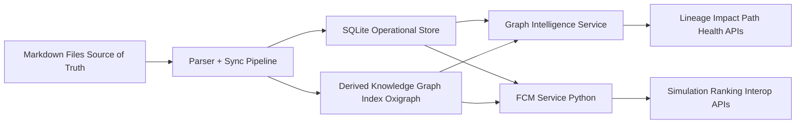

# SPEC-LOCAL-GRAPH-INTELLIGENCE-MASTER: Local+ Graph Intelligence Blueprint

**Status:** Draft (Iteration 2, Decision-Complete)  
**Date:** 2026-03-05  
**Owner:** Basic Memory  
**Primary Audience:** Internal build team (Product, Engineering, GTM)  
**Current Phase (2026-03-05):** Implementation Plan Phase 1 is complete; Phase 2 (SQL-backed graph logic) is the active engineering phase.  
**Related Specs:**
1. `/docs/specs/SPEC-LOCAL-GRAPH-INTELLIGENCE.md`
2. `/docs/specs/SPEC-LOCAL-GRAPH-INTELLIGENCE-TECHNICAL-ADDENDUM.md`
3. `/docs/specs/SPEC-LOCAL-GRAPH-INTELLIGENCE-IMPLEMENTATION-PLAN.md`

Reading guide:
1. Sections 1-5 define the business and product decisions.
2. Sections 6-10 define architecture and interface contracts.
3. Sections 11-14 define pricing, rollout, and decision gates for execution.

## 1) Executive Thesis

Basic Memory will ship **Local+ Graph Intelligence** as a premium local capability that upgrades the product from retrieval to decision support.

Positioning statement:
1. "Keep your local workflow. Add decision intelligence as complexity grows."
2. The product sells safer decisions and explainable recommendations, not graph database mechanics.

Locked thesis decisions:
1. SQLite will remain the operational core.
2. Markdown will remain source of truth.
3. Graph and FCM indexes will be derived and rebuildable.
4. Oxigraph/pyoxigraph will be the v1 graph index path.
5. FCM simulation will run in a Python service layer.
6. SurrealDB and FalkorDB will not be core dependencies in v1 due license-roadmap mismatch.
7. Product messaging will sell outcomes (safer decisions, explainable recommendations), not database internals.

## 2) Problem and Opportunity

Current state after v0.19:
1. Recursive SQL traversal can retrieve connected notes but becomes expensive and noisy after a few hops.
2. Users still do manual synthesis for impact analysis, decision lineage, and contradiction resolution.
3. Researchers need causal reasoning and scenario modeling, not only graph navigation.

Opportunity:
1. Deliver a premium local tier that materially improves decision quality while keeping data local.
2. Create a bridge from knowledge graph navigation to causal simulation (FCM).
3. Open a research-heavy market segment that values explainability and model interoperability.

Business opportunity:
1. Add a middle tier between free OSS and cloud subscription.
2. Preserve an upgrade path to hosted collaboration for research teams later.
3. Differentiate Basic Memory for research-grade workflows without forcing cloud adoption.

## 3) User Segments and Jobs-to-be-Done

| Segment | Primary Job-to-be-Done | Pain Today | Value Trigger |
|---|---|---|---|
| Casual local builder | Avoid breaking related notes when editing | Hidden dependencies and rework | Impact preview before edits |
| Solo technical founder | Keep architecture and decision context coherent | Context overload and drift | Decision lineage + impact radius |
| Research user | Model and test intervention strategies | No integrated causal simulation with notes | FCM simulation + action ranking |
| Product/research lead | Synthesize evidence quickly across many docs | Fragmented understanding | Path exploration + priority briefs |

## 4) Product Outcomes (not feature list)

Local+ Graph Intelligence will optimize for these outcomes:
1. **Change Safety:** users catch downstream impacts before they edit.
2. **Decision Clarity:** users can explain why an answer or recommendation was produced.
3. **Knowledge Health:** users keep larger graphs coherent with less manual audit work.
4. **Research Leverage:** users run scenario-level reasoning tied to explicit evidence.

Outcome metrics (for 30-day retained Local+ cohorts):
1. Median time-to-understanding for complex topics decreases by at least 35% for active Local+ users.
2. User-reported surprise side effects after note edits decrease by at least 30%.
3. At least 60% of active Local+ users invoke graph intelligence features weekly.
4. At least 40% of research-profile Local+ users invoke one FCM workflow weekly.

## 5) Feature Set v1/v1.5/v2

### v1 (post-v0.19 launch scope)

Included:
1. Decision Lineage
2. Impact Radius
3. Path Explorer (guided)
4. Graph Health (orphans, stale-central nodes, overloaded hubs)
5. CSV FCM import/export (nodes and edges)
6. FCM simulation for explicit action scenarios
7. FCM action ranking with evidence-linked rationale

Excluded:
1. Native Mental Modeler project format write support
2. Team governance and shared model policy controls
3. Cloud-only enhancements

### v1.5

Included:
1. Contradiction Watch with reconciliation queue
2. Priority Briefs (graph + FCM leverage summary)
3. Stronger uncertainty propagation in FCM scoring
4. Cloud execution optionality for heavy simulation jobs

### v2

Included:
1. Team-shared model governance
2. Hosted collaboration features for research teams
3. Optional native model translators beyond CSV baseline

Cut line policy:
1. If a capability cannot meet explainability requirements, it moves to v1.5+.
2. If a capability requires cloud to function, it cannot be marked v1.
3. If a capability cannot meet local performance envelopes, it cannot be promoted into default workflows.

## 6) Technical Architecture (Two-Graph Model)

### High-level architecture



### Two-graph model

1. **Knowledge Graph (descriptive):** notes, decisions, concepts, and typed relations.
2. **FCM Graph (causal):** signed weighted influence links between goals, drivers, risks, and interventions.

### Core architectural decisions

1. SQLite is authoritative for entities, observations, relations, metadata, embeddings, and project state.
2. Oxigraph is a derived index for multi-hop graph traversal and graph-pattern retrieval.
3. FCM calculations run in Python using explicit model state and deterministic numerical steps.
4. Local mode runs fully offline.
5. Cloud mode can execute the same contracts via adjunct services while Neon remains system of record.

## 7) Backend Decision and Trade-Offs

### Final recommendation

Use this stack for v1:
1. SQLite (existing): primary operational store.
2. Oxigraph/pyoxigraph: derived knowledge graph index.
3. Python FCM service: causal simulation and ranking.

Decision rationale:
1. This preserves local-first UX while enabling deeper traversal and causal simulation.
2. This avoids restrictive licensing dependencies in the core product path.
3. This keeps a clean cloud portability path where Neon remains the hosted system of record.

### Trade-off matrix

| Option | Strengths | Risks | Decision |
|---|---|---|---|
| SQLite + Oxigraph + Python FCM | Local-first, permissive licensing, clear service boundaries, cloud-portable | Requires translation layer for query ergonomics | **Adopt v1** |
| Apache AGE on Postgres | SQL+graph in one engine, good cloud-side graph semantics | Neon extension support uncertainty, weaker local/cloud parity with SQLite local baseline | Defer |
| SurrealDB | Strong integrated multi-model experience | BSL posture conflicts with future hosted/open strategy timing | Reject for v1 core |
| FalkorDB | Graph performance and Redis ecosystem familiarity | SSPL posture conflicts with hosted/open strategy | Reject for v1 core |

## 8) Public APIs / Interfaces

All APIs are proposed MCP tool contracts for Local+ mode.

### Common conventions

1. `project` parameter is optional and follows existing Basic Memory project routing.
2. Deterministic fields are reproducible with identical inputs and index state.
3. Probabilistic fields are model-derived scores and include confidence metadata.
4. Error model uses structured codes and fail-fast behavior.

Shared error codes:
1. `INVALID_ARGUMENT`
2. `NOT_FOUND`
3. `MODEL_INVALID`
4. `INDEX_NOT_READY`
5. `RESOURCE_LIMIT_EXCEEDED`
6. `INTERNAL_ERROR`

---

### 8.1 `graph_lineage(start, goal?)`

**Input schema:**
```json
{
  "start": "string (required, permalink or memory URL)",
  "goal": "string (optional, concept or decision target)",
  "max_hops": "integer (optional, default 4, range 1-6)",
  "relation_filters": ["string"],
  "project": "string (optional)"
}
```

**Output schema:**
```json
{
  "root": {"id": "string", "title": "string", "permalink": "string"},
  "paths": [
    {
      "path_id": "string",
      "nodes": [{"id": "string", "title": "string"}],
      "edges": [{"relation": "string", "direction": "outgoing|incoming"}],
      "deterministic_path_score": 0.0,
      "confidence": 0.0,
      "evidence_refs": ["memory://..."]
    }
  ],
  "generated_at": "RFC3339"
}
```

**Deterministic fields:** root, nodes, edges, deterministic path score, generated timestamp.  
**Probabilistic fields:** confidence.

**Latency target:** p95 <= 450ms for `max_hops<=4`, graph envelope up to 50k nodes / 300k edges.

**Scale envelope:**
1. Tested local baseline: 50k nodes, 300k edges.
2. Expected degradation: path expansion can exceed latency target when candidate paths > 20k.

---

### 8.2 `graph_impact(target, horizon, relation_filters?)`

**Input schema:**
```json
{
  "target": "string (required)",
  "horizon": "integer (required, range 1-4)",
  "relation_filters": ["string"],
  "include_reasons": "boolean (default true)",
  "project": "string (optional)"
}
```

**Output schema:**
```json
{
  "target": {"id": "string", "title": "string"},
  "affected": [
    {
      "id": "string",
      "title": "string",
      "distance": 2,
      "impact_score": 0.0,
      "confidence": 0.0,
      "reasons": ["string"]
    }
  ],
  "summary": {"total_considered": 0, "total_returned": 0}
}
```

**Deterministic fields:** membership, distance, summary counts.  
**Probabilistic fields:** impact score, confidence.

**Latency target:** p95 <= 650ms for `horizon<=3` under baseline envelope.

**Scale envelope:**
1. `affected` default cap: 200 items.
2. Hard cap: 1000 items with pagination token.

---

### 8.3 `graph_health(scope?, timeframe?)`

**Input schema:**
```json
{
  "scope": "string (optional, directory prefix or project-wide)",
  "timeframe": "string (optional, e.g. 30d, 90d)",
  "project": "string (optional)"
}
```

**Output schema:**
```json
{
  "metrics": {
    "orphan_rate": 0.0,
    "stale_central_nodes": 0,
    "overloaded_hubs": 0,
    "contradiction_candidates": 0
  },
  "issues": [
    {
      "issue_type": "orphan|stale_central|overloaded_hub|contradiction_candidate",
      "entity_id": "string",
      "severity": "low|medium|high",
      "reason": "string",
      "suggested_action": "string"
    }
  ],
  "computed_at": "RFC3339"
}
```

**Deterministic fields:** metrics and issue list membership for a fixed graph snapshot.  
**Probabilistic fields:** contradiction candidate confidence when present.

**Latency target:** p95 <= 1500ms project-wide; <= 700ms for scoped directory mode.

**Scale envelope:** project-wide scans tested to 50k nodes.

---

### 8.4 `fcm_simulate(actions, scenario?, clamp_rules?)`

**Input schema:**
```json
{
  "actions": [
    {"node_id": "string", "delta": 0.2}
  ],
  "scenario": {
    "steps": 12,
    "activation": "tanh|sigmoid|bounded_linear",
    "decay": 0.05
  },
  "clamp_rules": [
    {"node_id": "string", "min": -1.0, "max": 1.0}
  ],
  "project": "string (optional)"
}
```

**Output schema:**
```json
{
  "baseline": [{"node_id": "string", "state": 0.12}],
  "projected": [{"node_id": "string", "state": 0.43}],
  "deltas": [{"node_id": "string", "delta": 0.31}],
  "stability": {
    "converged": true,
    "iterations_used": 9,
    "residual": 0.002
  },
  "confidence": 0.0,
  "explanations": [
    {"node_id": "string", "top_influencers": [{"source": "string", "weight": 0.7}]}
  ]
}
```

**Deterministic fields:** baseline, projected, deltas, convergence metadata for fixed model and parameters.  
**Probabilistic fields:** confidence (derived from edge confidence and evidence coverage).

**Latency target:** p95 <= 1000ms for up to 500 nodes / 5000 edges and <=12 steps.

**Scale envelope:**
1. Soft limit: 2000 nodes / 20000 edges.
2. Over soft limit: return `RESOURCE_LIMIT_EXCEEDED` with remediation guidance.

---

### 8.5 `fcm_rank_actions(goal, constraints?, top_k?)`

**Input schema:**
```json
{
  "goal": "string (required node_id)",
  "constraints": {
    "max_negative_impact": 0.25,
    "required_tags": ["string"],
    "disallowed_nodes": ["string"]
  },
  "top_k": "integer (default 10, range 1-25)",
  "project": "string (optional)"
}
```

**Output schema:**
```json
{
  "goal": {"node_id": "string", "label": "string"},
  "recommendations": [
    {
      "action_node_id": "string",
      "expected_goal_delta": 0.0,
      "risk_penalty": 0.0,
      "net_score": 0.0,
      "confidence": 0.0,
      "rationale": ["string"],
      "evidence_refs": ["memory://..."]
    }
  ]
}
```

**Deterministic fields:** candidate action set, constraints compliance.  
**Probabilistic fields:** expected goal delta, risk penalty, net score, confidence.

**Latency target:** p95 <= 1500ms for top 10 from up to 100 candidate actions.

**Scale envelope:**
1. Candidate actions hard cap: 1000.
2. For larger sets, require pre-filtering via tags/scope.

---

### 8.6 `fcm_import_model(source, format)`

**Input schema:**
```json
{
  "source": "string (required path or URI)",
  "format": "csv_bundle_v1 (required)",
  "merge_mode": "replace|upsert (default upsert)",
  "project": "string (optional)"
}
```

**Output schema:**
```json
{
  "import_id": "string",
  "nodes_loaded": 0,
  "edges_loaded": 0,
  "warnings": ["string"],
  "errors": ["string"]
}
```

**Deterministic fields:** load counts and validation results.  
**Probabilistic fields:** none.

**Latency target:** p95 <= 2500ms for 10k edges CSV bundle.

**Scale envelope:**
1. Maximum CSV rows per import: 250k.
2. Above limit returns `RESOURCE_LIMIT_EXCEEDED`.

---

### 8.7 `fcm_export_model(format, selection?)`

**Input schema:**
```json
{
  "format": "csv_bundle_v1 (required)",
  "selection": {
    "scope": "all|tag|subgraph",
    "tag": "string (optional)",
    "seed_nodes": ["string"]
  },
  "project": "string (optional)"
}
```

**Output schema:**
```json
{
  "export_id": "string",
  "format": "csv_bundle_v1",
  "files": [
    {"name": "nodes.csv", "path": "string"},
    {"name": "edges.csv", "path": "string"}
  ],
  "node_count": 0,
  "edge_count": 0
}
```

**Deterministic fields:** file set and row counts for fixed selection.  
**Probabilistic fields:** none.

**Latency target:** p95 <= 1800ms for 50k edges export.

**Scale envelope:**
1. Max export rows: 500k total.
2. Pagination or scoped export required above cap.

## 9) Data Model and Storage Boundaries

### 9.1 Knowledge graph schema (descriptive)

`KnowledgeNode`:
1. `id: str`
2. `kind: note|decision|spec|concept|person|project`
3. `title: str`
4. `permalink: str`
5. `tags: list[str]`
6. `updated_at: datetime`

`KnowledgeEdge`:
1. `id: str`
2. `src_id: str`
3. `dst_id: str`
4. `relation: str`
5. `directionality: directed|bidirectional`
6. `evidence_refs: list[str]`
7. `confidence: float [0,1]`
8. `updated_at: datetime`

### 9.2 FCM schema (causal signed weighted)

`FCMNode`:
1. `id: str`
2. `label: str`
3. `node_type: goal|driver|risk|intervention|context`
4. `state: float [-1,1]`
5. `clamp_min: float`
6. `clamp_max: float`
7. `metadata: map`

`FCMEdge`:
1. `id: str`
2. `source_id: str`
3. `target_id: str`
4. `weight: float [-1,1]`
5. `confidence: float [0,1]`
6. `time_decay: float [0,1]`
7. `evidence_refs: list[str]`
8. `updated_at: datetime`

### 9.3 Provenance model

`ProvenanceRecord`:
1. `entity_id: str`
2. `evidence_refs: list[str]`
3. `confidence: float [0,1]`
4. `updated_at: datetime`
5. `source_type: extracted|user_authored|imported`

### 9.4 Scenario model

`Scenario`:
1. `id: str`
2. `name: str`
3. `interventions: list[{node_id, delta}]`
4. `constraints: list[{node_id, min, max}]`
5. `steps: int`
6. `activation: tanh|sigmoid|bounded_linear`
7. `created_at: datetime`
8. `created_by: str`

`ScenarioResult`:
1. `scenario_id: str`
2. `converged: bool`
3. `iterations_used: int`
4. `residual: float`
5. `goal_deltas: list[{node_id, delta}]`
6. `confidence: float [0,1]`

### 9.5 Storage boundaries

| Layer | System of Record | Purpose | Rebuildable |
|---|---|---|---|
| Markdown files | File system | Canonical knowledge content | No |
| SQLite entities/relations/embeddings | SQLite | Operational queries and project state | Yes (from markdown + embedding pipeline) |
| Knowledge graph triples | Oxigraph | Fast graph traversal and pattern queries | Yes |
| FCM model and snapshots | SQLite + optional artifacts | Causal model state and scenario history | Yes (from imports and authored model definitions) |

## 10) Mental Modeler Interoperability

### v1 interoperability contract

Format: `csv_bundle_v1`
1. `nodes.csv`
2. `edges.csv`
3. Optional `scenarios.csv`

`nodes.csv` required columns:
1. `node_id`
2. `label`
3. `node_type`
4. `state`
5. `clamp_min`
6. `clamp_max`

`edges.csv` required columns:
1. `edge_id`
2. `source_id`
3. `target_id`
4. `weight`
5. `confidence`
6. `evidence_refs` (semicolon-delimited)

### Import rules

1. Missing required columns fail with `MODEL_INVALID`.
2. Unknown node types fail fast.
3. Weight and confidence ranges are strictly validated.
4. Import returns warnings for dangling evidence references.

### Export rules

1. Preserve stable IDs for round-trip compatibility.
2. Preserve signed weights exactly.
3. Preserve confidence values exactly.
4. Non-portable metadata is emitted to `metadata.json` sidecar when present.

### Native file translators

1. Native project-format translation is deferred to v2.
2. CSV remains the guaranteed compatibility baseline in v1 and v1.5.

## 11) Pricing and Packaging

### Tier structure

| Tier | Price Monthly | Price Annual | Beta Price (25% off) | Target Persona | Core Value |
|---|---:|---:|---:|---|---|
| OSS Local | $0 | $0 | $0 | Casual local users | Retrieval and memory basics |
| Local+ Graph Intelligence | $9 | $90 | $6.75 monthly / $67.50 annual | Founders, consultants, researchers | Safer changes + explainable graph + FCM simulation |
| Cloud Pro (current anchor) | $19 | $190 | $14.25 monthly / $142.50 annual | Users who need hosted sync and cloud workflows | Managed cloud + sync + collaboration path |

Pricing principles:
1. Local+ is intentionally priced between free OSS and cloud to capture users who need deeper intelligence but not hosted sync.
2. Cloud Pro remains the hosted convenience anchor and future collaboration path.
3. Local+ must stand on standalone local value and cannot depend on cloud features.

### Feature gate mapping

| Capability | OSS Local | Local+ | Cloud Pro |
|---|---|---|---|
| Search and basic context tools | Yes | Yes | Yes |
| Decision Lineage | No | Yes | Yes |
| Impact Radius | No | Yes | Yes |
| Graph Health | No | Yes | Yes |
| FCM simulate + rank | No | Yes | Yes |
| CSV model import/export | No | Yes | Yes |
| Hosted collaboration controls | No | No | Future add-on |

### Packaging decisions

1. Local+ remains fully local-capable and does not require cloud auth to run.
2. Cloud Pro remains the hosted convenience and collaboration anchor.
3. Future hosted research add-on will layer on Cloud Pro after v2 readiness.

## 12) Rollout Strategy

### 12.1 Document production iterations (locked)

Iteration 1 (draft complete):
1. Complete all 15 sections in one pass.
2. Include v1/v1.5/v2 cut lines.
3. Include pricing and scenario definitions.
4. Ensure no placeholders.

Iteration 2 (hardening and decision lock):
1. Resolve cross-section contradictions.
2. Convert uncertain language to locked decisions.
3. Add measurable acceptance criteria and risk owners.
4. Finalize execution-ready API contracts.

### 12.2 Product rollout phases

Phase A: Foundation release (v1)
1. Graph lineage, impact, health.
2. CSV model import/export.
3. FCM simulation and ranking.
4. Advanced mode UX gating for research-grade controls.

Phase B: Quality and confidence (v1.5)
1. Contradiction Watch.
2. Priority Briefs.
3. Improved uncertainty propagation.
4. Confidence calibration pass using real-world model feedback.

Phase C: Team expansion (v2)
1. Hosted team governance.
2. Shared model controls.
3. Extended translator support.

### 12.3 Go/No-Go release gates

Gate to ship v1 default workflows:
1. p95 latency targets are met within the declared scale envelopes.
2. Scenario round-trip fidelity tests pass for CSV import/export.
3. Every recommendation and simulation path exposes evidence references and confidence.

Gate to ship v1.5:
1. Contradiction Watch precision is acceptable for default-on use.
2. Confidence calibration reduces false-confidence reports in user testing.

Gate to ship v2 team features:
1. Clear willingness-to-pay signal from team and research buyers.
2. Cloud execution path preserves local-cloud semantic parity for core contracts.

## 13) Risks, Counterarguments, and Mitigations

| Risk | Counterargument | Severity | Likelihood | Mitigation | Owner |
|---|---|---|---|---|---|
| "This is just better search" | Positioning can collapse into technical jargon | High | Medium | Lead with decision safety and explainability outcomes in product copy and onboarding | Product Lead |
| FCM feels opaque or invented | Users distrust black-box scoring | High | Medium | Require evidence refs and confidence disclosure on every recommendation | Applied AI Lead |
| Local performance regressions | Multi-hop and simulation can feel slow on laptops | Medium | Medium | Enforce envelopes, caps, and fail-fast limit errors with guidance | Engineering Lead |
| Research features overwhelm casual users | UX complexity can reduce adoption | Medium | High | Default to guided flows and hide advanced controls behind explicit advanced mode | Design Lead |
| License/roadmap conflict if backend changes | Later swap to restrictive engines creates GTM risk | High | Low | Lock permissive v1 stack and require leadership sign-off for any license-restricted dependency | Product + Legal |
| Interop mismatch with external tools | Round-trip drift harms trust with researchers | Medium | Medium | Validate node and edge parity in import/export tests and version interop schema | Integrations Lead |
| Pricing confusion between Local+ and Cloud Pro | Buyers may not understand which tier fits | Medium | Medium | Publish explicit tier comparison focused on local intelligence vs hosted collaboration | GTM Lead |

## 14) Acceptance Criteria

### 14.1 Document acceptance criteria

1. Product, technical, and pricing decisions are explicit and unambiguous.
2. API contracts include input/output schemas, error models, deterministic versus probabilistic fields, and performance envelopes.
3. v1/v1.5/v2 cut lines are explicit and consistent.
4. Risk register includes severity, likelihood, owner, and mitigation.
5. Document can be handed to implementation without additional architecture decisions.
6. Leadership can use this document directly for pricing and positioning decisions.

### 14.2 Product acceptance criteria for v1 delivery

1. `graph_lineage`, `graph_impact`, `graph_health`, `fcm_simulate`, `fcm_rank_actions`, `fcm_import_model`, and `fcm_export_model` are available as Local+ contracts.
2. Local mode executes all v1 contracts without cloud dependency.
3. API p95 latency targets are met within defined scale envelopes.
4. Every ranked or simulated output includes evidence-linked rationale and confidence.
5. CSV round-trip preserves node count, edge count, and signed weights exactly.

### 14.3 Scenario test matrix (required)

1. **Casual local user impact check**
Expected pass:
`graph_impact` returns ranked affected notes with reasons before a note edit.

2. **Research workflow simulation**
Expected pass:
User imports a model bundle, runs `fcm_simulate`, and receives converged deltas and rationale.

3. **Decision audit traceability**
Expected pass:
`graph_lineage` returns path and evidence references that explain recommendation origin.

4. **Cloud and local parity**
Expected pass:
Identical query inputs return semantically equivalent outputs in local and cloud modes with local fallback behavior when cloud is unavailable.

5. **Sparse or contradictory graph behavior**
Expected pass:
System degrades gracefully with explicit uncertainty and does not fabricate high-confidence recommendations.

6. **Interop round-trip fidelity**
Expected pass:
`fcm_export_model` then `fcm_import_model` preserves node and edge counts and signed weights without mutation.

## 15) Appendix (license notes, terminology, examples)

### 15.1 License notes (verified 2026-03-05)

1. SurrealDB core licensing is published under BSL 1.1 with DBaaS-related restrictions in its conversion window.
2. FalkorDB is published under SSPLv1.
3. pyoxigraph is dual-licensed Apache-2.0 or MIT.
4. Neon extension catalog currently does not list Apache AGE as a supported extension.

These notes support the v1 dependency decisions in this document.

### 15.2 Terminology

1. **Knowledge graph:** descriptive relation graph derived from markdown knowledge.
2. **FCM:** fuzzy cognitive model with signed weighted causal edges.
3. **Deterministic field:** reproducible output field from fixed input and fixed model/index snapshot.
4. **Probabilistic field:** score influenced by confidence weights and model uncertainty.

### 15.3 Assumptions and defaults

1. Markdown remains source of truth.
2. SQLite remains mandatory baseline.
3. Graph and FCM capabilities are premium Local+ features, not OSS defaults.
4. Research-heavy features are advanced mode, while mainstream UX stays guided.
5. Mental Modeler interoperability starts with CSV contract first; native translator support is deferred.

### 15.4 Out of scope for this document

1. Implementation code changes.
2. Database migrations.
3. Cloud infrastructure edits.
4. Full instrumentation pilot plan as the primary artifact.

### 15.5 External references

1. [SurrealDB licensing](https://surrealdb.com/license)
2. [FalkorDB licensing](https://docs.falkordb.com/References/license.html)
3. [pyoxigraph package and license](https://pypi.org/project/pyoxigraph/)
4. [Neon Postgres extension catalog](https://neon.com/docs/extensions/pg-extensions)
