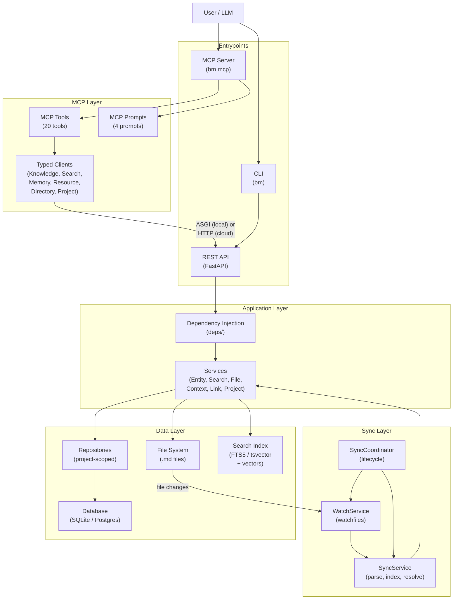
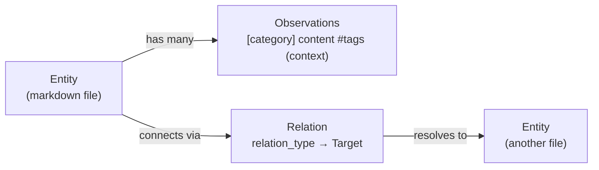
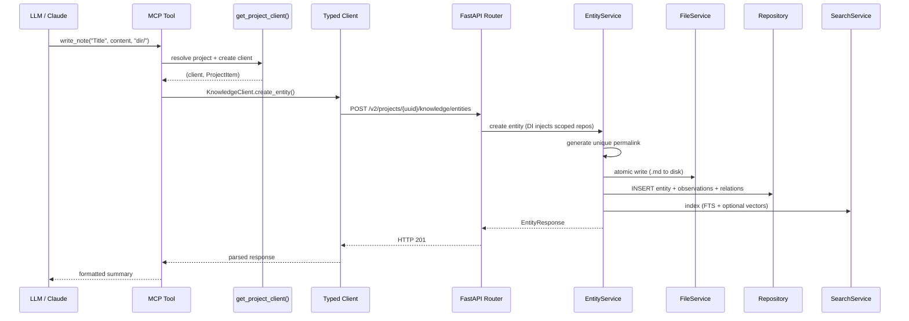
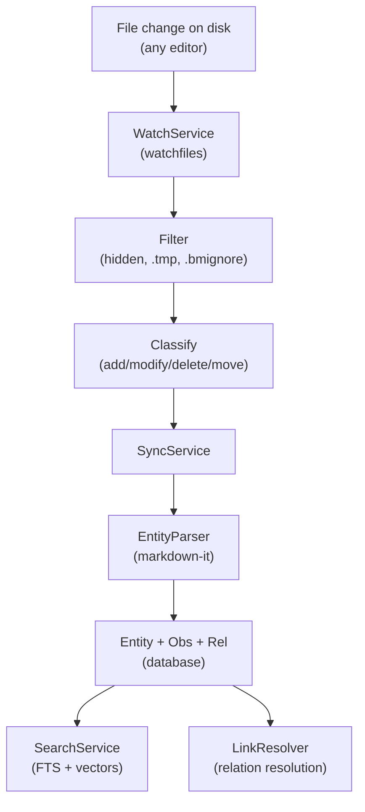
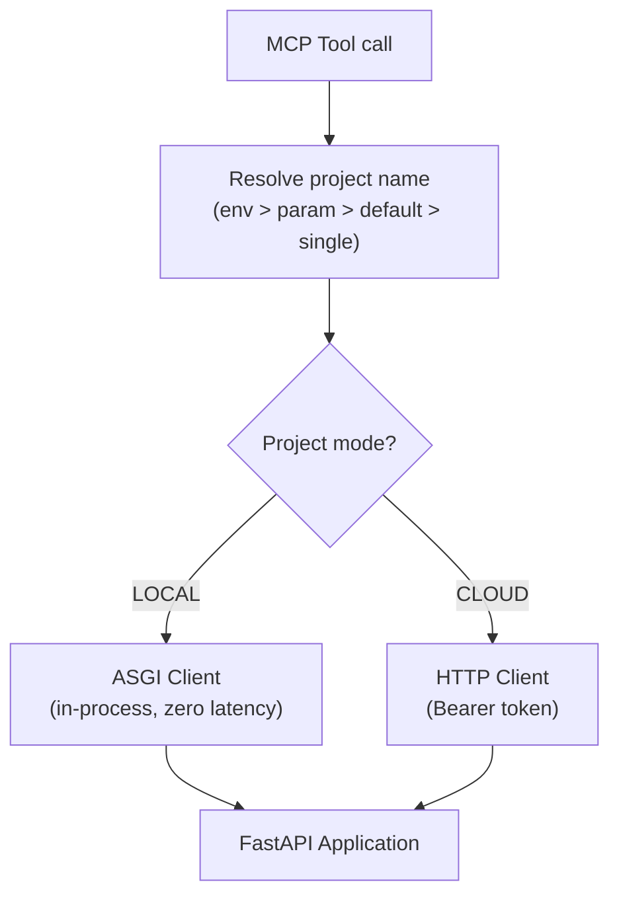

# Basic Memory: Complete System Research

## What Is Basic Memory?

Basic Memory is a local-first knowledge management system built on the Model Context Protocol (MCP). It gives LLMs persistent memory across conversations through a personal knowledge graph stored as plain markdown files.

**Core insight:** Markdown files are the source of truth. The database (SQLite or Postgres) is a disposable index for fast search and graph traversal. Delete the DB, rebuild it from files. Edit a file in Obsidian or vim, the sync system picks up the change.

---

## System Architecture



Each entrypoint has a **composition root** (`container.py`) that reads config once and wires dependencies explicitly. No global singletons.

---

## The Knowledge Model



### Entities
A markdown file = an entity. Has: title, type (default "note"), permalink, external UUID, file path, checksum.

### Relations
Directed edges via WikiLink syntax: `- depends_on [[Database Layer]]`. Relation type is active voice. Target resolved by LinkResolver (UUID → permalink → title → path → FTS fallback). Unresolved relations retry on future syncs.

### Observations: The Four Components

Each observation line carries up to four pieces of information with different indexing weights:

```
- [Decision] Migrate to PostgreSQL #architecture #infra (Approved Q4 planning)
    │              │                    │                       │
    ▼              ▼                    ▼                       ▼
 category       content              tags                   context
```

| Component | Storage | Index Weight | Purpose |
|-----------|---------|-------------|---------|
| `[category]` | Dedicated DB column + index | **Heavy** — column index + vector embedding | "What type of fact?" Filter by decision/bug/feature |
| content | Text in `Observation.content` | **Heavy** — FTS + vector embedding | The actual fact |
| `#tags` | JSON array in `Observation.tags` + embedded in content | **Moderate** — metadata filter + FTS | Cross-cutting keywords across categories |
| `(context)` | Optional text in `Observation.context` | **Light** — DB column only, excluded from search index + vectors | Provenance: who/when/where |

**Why three annotation mechanisms?** They answer different questions at different indexing weights. Category gives structural type (one per observation, heavily indexed). Tags enable cross-cutting discovery (many per observation, moderately indexed). Context adds provenance without polluting search relevance (lightly indexed). A flat tagging system would collapse all three into one bucket.

**Finding: `(context)` documentation gap.** The `write_note` tool docstring documents context annotations with examples like `(All state comes from files)`. But the `ai_assistant_guide` resource — the primary document teaching LLMs how to use Basic Memory — never mentions `(context)` in any of its observation examples or templates. This means LLMs likely underutilize context annotations in practice.

### The Markdown Format

```markdown
---
title: Search Feature
type: spec
permalink: specs/search-feature
tags: [search, v1]
---

Free-form markdown content (preserved exactly).

- [feature] Boolean operators like AND, OR, NOT #search #query
- [feature] FTS5 backend with BM25 scoring #performance (added v0.12)
- [decision] Hybrid search by default #architecture (approved Q3)

- depends_on [[Database Layer]]
- implements [[Search Requirements]]
```

**Parsing:** `observation_plugin` in `markdown/plugins.py` uses markdown-it + regex. Extracts `[category]`, content, `#tags` (extracted to array but left in content), and trailing `(context)` (removed from content, stored separately). `MarkdownProcessor` handles the reverse: serializing back to `- [category] content (context)`.

---

## Request Flow



**Key detail:** Local tools use ASGI transport (in-process, zero network). Cloud tools use HTTP with Bearer token. Same API layer handles both.

---

## All MCP Tools (20)

### Content Management

| Tool | Description | Key Parameters |
|------|-------------|----------------|
| `write_note` | Create or update a markdown note with semantic observations and relations | `title`, `content`, `directory`, `tags`, `note_type`, `metadata` |
| `read_note` | Read note by title, permalink, or memory:// URL. Fallback: direct → title → FTS | `identifier`, `page`, `page_size`, `include_frontmatter` |
| `view_note` | Read note as formatted artifact for better readability | `identifier`, `page`, `page_size` |
| `edit_note` | Incremental edits without full rewrite | `identifier`, `operation` (append/prepend/find_replace/replace_section), `content`, `find_text`, `section`, `expected_replacements` |
| `delete_note` | Delete a note or directory | `identifier`, `is_directory` |
| `move_note` | Move note/directory, update DB and links | `identifier`, `destination_path`, `destination_folder`, `is_directory` |
| `read_content` | Read raw file content (text, images, binary) without knowledge graph processing | `path` |

### Search & Discovery

| Tool | Description | Key Parameters |
|------|-------------|----------------|
| `search_notes` | Full-text, semantic, or hybrid search with advanced filtering | `query`, `search_type` (text/title/permalink/vector/semantic/hybrid), `note_types`, `entity_types`, `after_date`, `metadata_filters`, `tags`, `status`, `min_similarity` |
| `build_context` | Navigate knowledge graph via memory:// URLs | `url`, `depth`, `timeframe`, `page`, `page_size`, `max_related` |
| `recent_activity` | Recent changes; discovery mode (all projects) or project-specific | `type`, `depth`, `timeframe` |
| `list_directory` | Browse directory structure with depth and glob filtering | `dir_name`, `depth`, `file_name_glob` |

### Project Management

| Tool | Description | Key Parameters |
|------|-------------|----------------|
| `list_memory_projects` | List all projects (local + cloud merged view) | `workspace` |
| `create_memory_project` | Create new project | `project_name`, `project_path`, `set_default` |
| `delete_project` | Remove project from config (files stay on disk) | `project_name` |
| `list_workspaces` | List available cloud workspaces | — |

### Visualization & Compatibility

| Tool | Description | Key Parameters |
|------|-------------|----------------|
| `canvas` | Generate Obsidian canvas files (JSON Canvas 1.0) | `nodes`, `edges`, `title`, `directory` |
| `search` | ChatGPT/OpenAI actions compatible search | `query` |
| `fetch` | ChatGPT/OpenAI actions compatible document fetch | `id` |

### Utility

| Tool | Description |
|------|-------------|
| `cloud_info` | Cloud setup guidance |
| `release_notes` | Latest product release notes |

**Common patterns across all tools:**
- `project: Optional[str]` — resolved via hierarchy: env constraint > explicit > default > single project
- `workspace: Optional[str]` — for cloud multi-tenancy
- `output_format: Literal["text", "json"]` — human-readable or machine-readable
- `context: Context` — FastMCP session caching
- Path traversal security validation on all file operations

---

## MCP Prompts (4)

Prompts return formatted output with instructions for the LLM:

| Prompt | Purpose | Key Parameters |
|--------|---------|----------------|
| `continue_conversation` | Resume previous work; searches topic or shows recent activity with next steps | `topic`, `timeframe` |
| `search_prompt` | Search with detailed formatted results and context | `query`, `timeframe` |
| `recent_activity_prompt` | Recently changed items with formatted output | `timeframe`, `project` |
| `ai_assistant_guide` | Resource teaching LLMs how to use Basic Memory effectively; adapts to config (default project vs multi-project) | — |

---

## Search: Three Modes

### Full-Text Search (FTS)
SQLite FTS5 with BM25 / Postgres tsvector with ts_rank. Boolean operators (AND, OR, NOT), prefix matching, pattern matching, filtering by note_type/entity_type/after_date/tags/metadata.

### Semantic Search (Vector Embeddings)
**Enabled by default** — auto-detected from installed packages (`fastembed` + `sqlite_vec`):
- Content chunked into ~900-char segments with 120-char overlap
- Embedded via FastEmbed (bge-small-en-v1.5, 384 dimensions)
- Vectors stored in sqlite-vec (SQLite) or pgvector (Postgres)
- Observation category is included in the vector (semantic difference between "a decision about X" and "a question about X")
- Context annotations deliberately excluded from vectors
- Auto-backfill on migration upgrade (no manual `bm reindex` needed)

Config: `semantic_vector_k=100`, `semantic_min_similarity=0.55`, `semantic_embedding_batch_size=64`

### Hybrid Search (Default)
Fuses both: vector top-K candidates → FTS keyword scoring → `fts_score + 0.3 * vector_score`

### Backend
Protocol pattern: `SQLiteSearchRepository` and `PostgresSearchRepository` implement the same interface. Factory picks at runtime.

---

## Sync System



**Processing order:** Moves → Deletes → New files → Modified files → Relation resolution

**Watermark optimization:** Tracks `last_scan_timestamp` + `last_file_count` per project. Incremental scan via `find -newermt` when no deletions detected. 225x faster for no-change case.

**Circuit breaker:** 3 consecutive failures → skip file. Resets on checksum change.

---

## Database & Repository Layer

**Dual backend:** SQLite (default, WAL mode, zero setup) / Postgres (asyncpg, NullPool, 30s Neon timeouts).

**Project-scoped repositories:** Every `Repository[T]` is instantiated with `project_id` that auto-filters all queries. Cross-project leakage is structurally impossible.

**Two query modes:** Full loading (eager-loads observations/relations) vs lightweight (only needed fields for bulk ops).

**Migrations:** Alembic with 19+ versions. Auto-backfill semantic embeddings on upgrade.

---

## Project Routing



MCP server always runs locally. Individual projects can route to cloud independently. `--local`/`--cloud` CLI flags override. `BASIC_MEMORY_FORCE_LOCAL=true` forces local globally.

---

## CLI Commands

```
bm status          — file/DB sync status
bm doctor          — end-to-end consistency check
bm mcp             — start MCP server (stdio/HTTP/SSE)
bm watch           — background file watcher
bm reindex         — rebuild FTS and/or semantic indexes
bm reset           — reset database (rebuilds from files)
bm format          — run formatter on markdown files
bm import claude   — import Claude conversation exports
bm import chatgpt  — import ChatGPT exports
bm project list|add|remove|info|sync|bisync|default
bm cloud login|logout|status|setup
bm tool            — CLI access to MCP tools
```

---

## Key Design Decisions

| Decision | Rationale |
|----------|-----------|
| Files as source of truth | Never locked in; any editor works; git versioning; DB is disposable |
| MCP as integration layer | Standard protocol; any LLM client can use it; future-proof |
| In-process ASGI | Zero network overhead locally; same API layer for local and cloud |
| Per-project routing | Mix local and cloud projects; use Claude Desktop + cloud simultaneously |
| Composition roots | Config read once; explicit wiring; testable; no globals |
| Project-scoped repos | Auto-filter all queries by project_id; impossible to leak data |
| Two-phase relation resolution | Reference entities that don't exist yet; resolved on future sync |
| Fast path + background tasks | Write immediately; defer indexing/resolution; snappy UX |
| Three observation annotations | Different indexing weights for different query patterns |
| Vector embeddings by default | Auto-detected; hybrid search out of the box |

---

## Findings

1. **`(context)` annotation gap in AI guide:** The `write_note` tool docstring documents `(optional context)` with examples. But the `ai_assistant_guide` resource — the primary document that teaches LLMs how to use Basic Memory — shows observation examples without `(context)` and its templates omit it. LLMs likely underutilize this feature.

2. **Vector embeddings are invisible to users:** Semantic search is enabled by default via package auto-detection, and the default search mode is `"hybrid"`. Users get vector-enhanced search without configuring anything, but may not realize it's happening or how to tune it.

---

## Configuration

Stored at `~/.basic-memory/config.json`, overridable via `BASIC_MEMORY_*` env vars.

Key: `database_backend` (sqlite/postgres), `semantic_search_enabled` (auto-detected), `semantic_embedding_model` (bge-small-en-v1.5), `semantic_vector_k` (100), `semantic_min_similarity` (0.55), `sync_delay` (1000ms), `cloud_api_key`, `projects` dict with per-project `path`, `mode`, `workspace_id`.

---

## Testing

- `tests/` — unit tests with mocks (fast)
- `test-int/` — integration tests, real implementations
- Coverage target: 100%
- SQLite default; Postgres via testcontainers in CI
- `just fast-check` → `just doctor` → `just test` development loop
